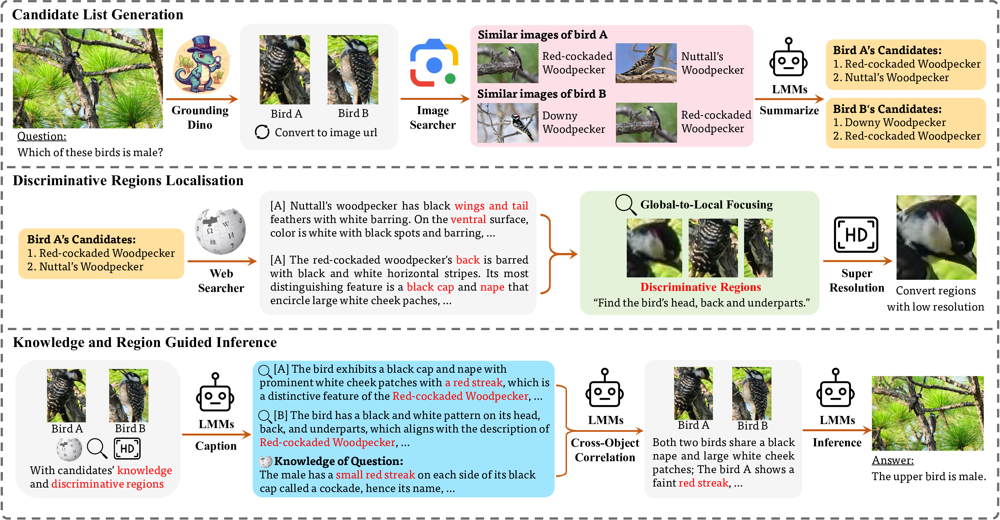

# Knowledge-Augmented Fine-Grained Reasoning Agent

[CVPR 2026] Code release for "Seeing as Experts Do: A Knowledge-Augmented Agent for Open-Set Fine-Grained Visual Understanding".

    

### Introduction
Fine-grained visual understanding is shifting from static classification to knowledge-augmented reasoning, where models must justify as well as recognise. Existing approaches remain limited by closed-set taxonomies and single-label prediction, leading to significant degradation under open-set or context-dependent conditions.

We present the Knowledge-Augmented Fine-Grained Reasoning Agent (KFRA), a unified framework that transforms fine-grained perception into evidence-driven reasoning. KFRA operates through a three-stage closed reasoning loop that emulates expert analysis. It first performs open-vocabulary detection and web-scale retrieval to generate category hypotheses. It then conducts discriminative regions localisation by aligning textual knowledge with visual evidence through a global-to-local focusing mechanism. Finally, it integrates all multimodal evidence within a large multimodal model to perform interpretable reasoning.

Unlike existing agents that treat retrieval and reasoning as independent processes, KFRA establishes a retrieval–grounding coupling that converts retrieved knowledge into spatially grounded evidence for verification. This design enables factual, interpretable, and task-agnostic reasoning across diverse fine-grained scenarios. To evaluate this capability, we construct FGExpertBench, a benchmark designed to assess reasoning depth and cross-task generalisation across six knowledge dimensions. Extensive experiments demonstrate that KFRA consistently surpasses both standalone large multimodal models and current agent frameworks, achieving up to 19 percent improvement in reasoning accuracy and delivering evidence-grounded interpretability in open-set fine-grained visual understanding.

## Contact
Thanks for your attention!
If you have any suggestion or question, you can leave a message here or contact us directly:
- chenjunhan@bupt.edu.cn
